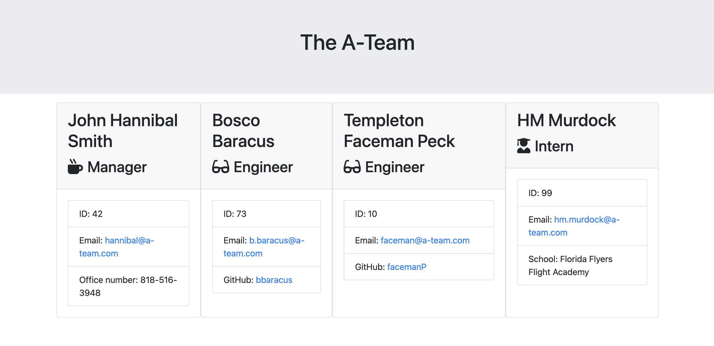

# Coll-hub
  
 
1. [Intro](#Intro) 
2. [Description](#Description) 
3. [Features](#Features) 
4. [Preview](#Preview) 
5. [Installation](#Installation) 
6. [Usage](#Usage) 
7. [License](#License) 

## Intro
Coll-hub is a dynamic team board powered by NodeJS & Bootstrap. Streamline team management with interactive member cards seamlessly with Coll-hub. 

## Description
Coll-hub is a command-line team board tool built with NodeJS, Bootstrap, and Inquirer. This open-source utility simplifies team organization by allowing users to designate a team name and effortlessly add software engineers and interns. With a CLI interface, Coll-hub provides a straightforward solution for managing teams, making it an efficient tool for those seeking simplicity in team structuring.
 

## Features
- Command-Line Interface (CLI): Coll-hub operates through a command-line interface, ensuring simplicity and ease of use.
- NodeJS and Bootstrap Integration: Powered by NodeJS and Bootstrap, Coll-hub leverages robust technologies for a stable and responsive performance.
- Inquirer Integration: The inclusion of Inquirer allows users to interactively choose a team name and add software engineers and interns with minimal effort.
- Open-Source: Coll-hub is an open-source project, allowing users to contribute, modify, and tailor it to their specific needs.
 
## Preview
 

## Installation
1. Clone the repository
	`git clone https://github.com/sonictrain/Coll-hub`

2. Move inside the repo directory
	`cd Coll-hub`

3. Install dependencies using
	`npm install`
 

## Usage
Simply run the generator with `node index.js` or `npm start` and follow the prompts.
The generated files will be placed inside `./output` and a file called 'team.html' will be saved.
 

## License
A short and simple permissive license with conditions only requiring preservation of copyright and license notices. Licensed works, modifications, and larger works may be distributed under different terms and without source code. 

---

Generate with [Better Readme](https://github.com/sonictrain/better-readme) Copyright (c) 2024, [Nicola Brucoli](https://github.com/sonictrain).